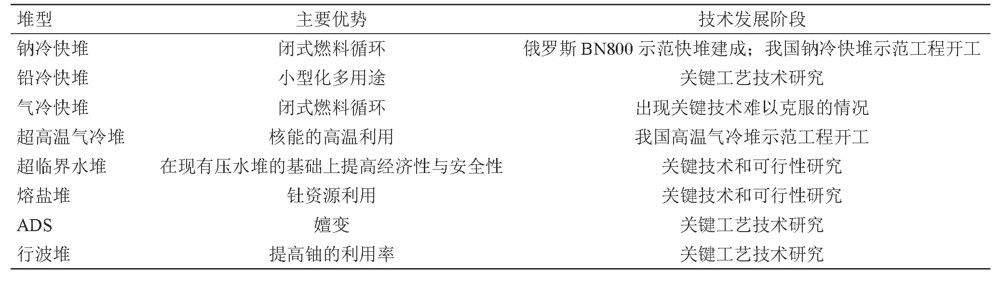
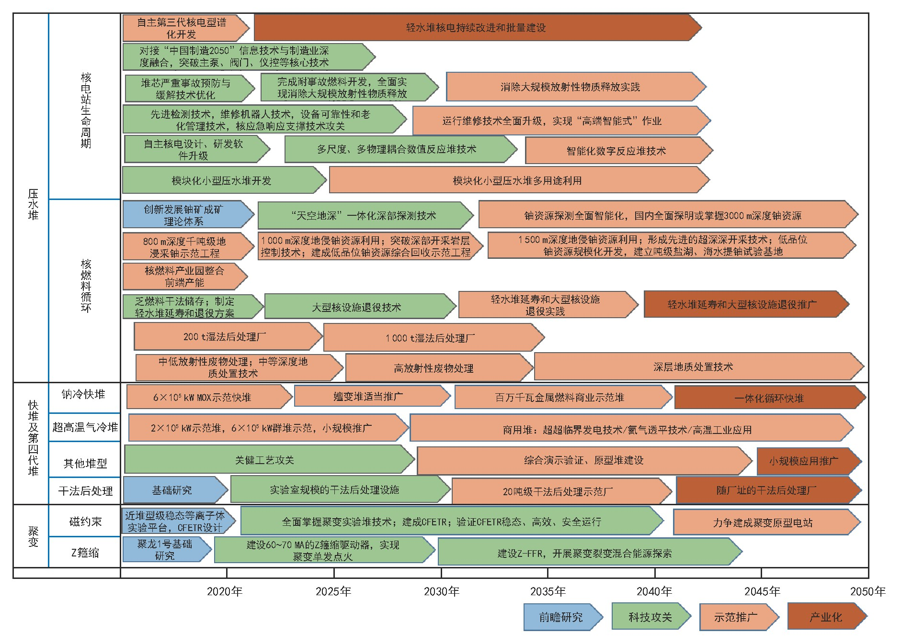
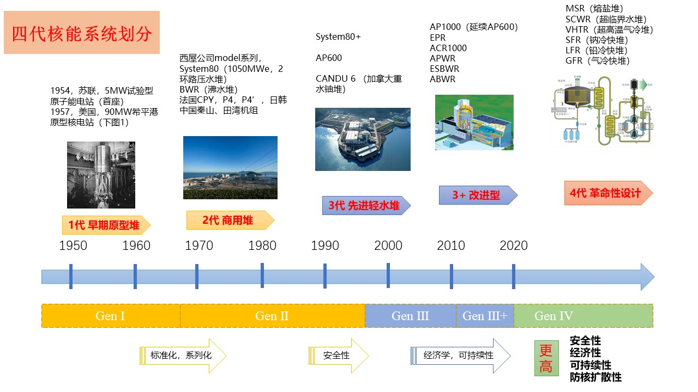

## 核能技术发展现状

1、压水堆是核电开发的首选

2、现役机组性能不断改善

3、高龄机组延寿成为趋势

4、三代堆成为核电建设的主流技术

5、小型模块化反应堆（SMR）研发掀起热潮

6、乏燃料管理压力增大，核燃料循环后端需求迫切

7、四代先进核能系统研发情况

## 核能发展方向

（一）热堆规模化发展：

1、铀资源勘查程度低。从地址勘查获天然铀，再经铀转化、铀同位素分离和制造核燃料元件制造入堆，该过程需要15年以上。

2、三代先进压水堆安全性和经济性优化平衡。

3、核电设备可靠性、运维技术、老化管理及应急响应技术完善和提高，实现“低端手工式”到“高端智能”转变。

4、核电软件自主化开发能力突破。美和欧盟正在开发“数值反应堆技术”。

5、乏燃料后处理能力提高

（二）快堆和四代堆

1、裂变燃料的增殖，核电长期规模化发展面临燃料供应不足的风险。

2、超铀元素分离和嬗变。超铀元素含有核燃料，是乏燃料长期放射性来源。

3、先进核能多用途利用。发电、供热、海水淡化、核动力领域等。

4、四代堆的优势、技术成熟度和发展空间明确。

（三）聚变堆

## 核能技术发展路线

参考资料[1]

------

## 发展四代堆的必要性

1、更好的经济性

三代堆输出约300℃的热，热电转换效率约为33%

四代输出≥500℃的热，热电转换效率（40%~60%）

可综合利用，包括制氢、海水净化、供热、干冷（可建在无水区）

2、更好的安全性

三代堆依靠外部动力去除反应堆停堆后的剩余热

四代堆使用自然循环去除剩余热，追求本征安全性，具有防备恐怖袭击和自然灾害能力

3、提高燃料利用率

三代堆的燃料利用率约为1~2%

四代堆的燃料利用率大于10%，追求完全的燃料循环

## 四代核能简介

三代核电技术主要不足是 核电站建设运营成本高、经济性差，且未有考虑有效防止核扩散。第四代核能系统自2002年第五次第四代核能系统国际论坛（GIF）提出，旨在进一步提高安全性，降低建设及运营成本，考虑防止核扩散的要求，使未来核电更加安全、廉价。

第四代核能系统概念不仅用于发电，还包括制氢及海水淡化等功能。具体堆型特点比较如下[2]：

|        反应堆        | 中子谱 |  冷却剂  | 出口温度/℃ | 燃料循环方式  |
| :------------------: | :----: | :------: | :--------: | :-----------: |
| 超临界水冷堆（SCWR） | 热/快  |    水    |  510-625   | 一次通过/闭式 |
| 超高温气冷堆（VHTR） |   热   |    氦    |  900-1000  |   一次通过    |
|  熔盐反应堆（MSR）   | 热/快  | 氟化物盐 |  700-800   |     闭式      |
|   钠冷快堆（SFR）    |   快   |    钠    |    550     |     闭式      |
|   铅冷快堆（LFR）    |   快   |    铅    |  480-800   |     闭式      |
|   气冷快堆（GFR）    |   快   |   氦气   |    850     |     闭式      |

> SINAP——《核能科学与技术概论》课程

## 参考文献

[1] 杜祥琬,叶奇蓁,徐銤,万元熙,彭先觉,苏罡,杨勇,高翔,师学明.核能技术方向研究及发展路线图[J].中国工程科学,2018,20(03):17-24.

[2] 成松柏等. 第四代核能系统与钠冷快堆概论[M]. 北京:国防工业出版社,2018.

