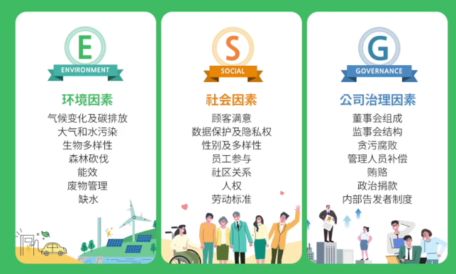
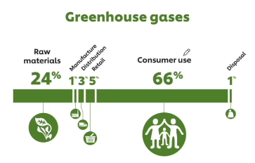
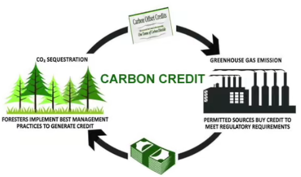

# Regulators want firms to own up to climate risks

That is good news for investors. And for the planet?

###  **regulators**  n.监管机构

### **own up to sth./ doing sth.**      承担责任、坦白

> e.g He was too frightened to own up to his mistake.

**[1]** American's main financial regulator is taking an interest in climate change and wants everyone to know.

### **take an interest in sth.**  对某事感兴趣

**[2]** The Securities and Exchange Commission（SEC）has created a task-force to examine environmental, social and governance（ESG）issues, appointed a climate tsar and said it will "enhance its focus" on climate-related disclosures for listed firms.

### **Securities and Exchange Commission**. 美国证券交易委员会

### **task force**     特别工作组

### **environmental, social and governance**. 环境，社会，治理

> ！！！ vuepress中注意插入图片"/"的位置

### **climate tsar**. n.气候顾问

### **tsar**.    英: [zɑː(r)]  n.沙皇，政府高级官员 

### **disclosure**  英: [dɪsˈkləʊʒə(r)]   n.公开 披露

### **disclose** v. 透露

### **listed firm**  n.上市公司

**[3]** <u>It looks poised to introduce</u>, among other things, <u>rules</u> forcing firms to reveal how climate change or efforts to fight it may affect their business.

### **be poised to do sth.** 准备好做某事

> e.g.  Kate is poised to become the highest-paid supermodel in the fashion world. 

### **reveal** v.揭示

> 句子结构：
>
> It looks poised to introduce rules
>
> rules that force firms to reveal sth.
>
> how A and B may affect their business.
>
> 证监会推出很多措施，其中提出一项规定，要求企业披露气候变换或对抗气候变化会对企业带来的影响。

 **[4]** Since September regulators in Britain, New Zealand ans Switzerland have said they plan to make such climate-related disclosures mandatory. So, too, have stock exchanges in Hong Kong, London and South Korea. The EU may follow suit.  

### **mandatory**  英: [ˈmændət(ə)ri]   adj.义务的、强制的

### **stock exchange** n.证券交易所

### **follow suit**  照着做

*美国金融监管机构带头关注气候变化问题，并要求企业披露气候的相关信息。世界其它地区的监管机构也采取了行动。*

------

**[5]** The flurry of rulemaking stems from a concern that climate change poses a threat to financial stability. Whether this is true or not is hard to say. The data are shoddy and climate-risk reporting is largely voluntary.

### **flurry of sth**. 一阵（忙乱），一顿操作

### stem from  根源是...

### pose a threat to 对...构成威胁

### shoddy   英: [ˈʃɒdi]  adj. 粗制滥造的，粗糙的

### voluntary adj.自愿的  

> volunteer

**[6]** Firms tend to cherry-pick the most flattering numbers and methodologies. The reporting seldom reveals anything about a firm's risk in the future—which is <u>where</u> the financial threats from climate change mostly <u>resid</u>e.

### cherry-pick  v.筛选、精选

### flattering  adj. 使人显得漂亮的

### flattery 英: ['flætəri]  n.阿谀奉承、讨好

### methodology  英: [ˌmeθəˈdɒlədʒi]  n.方法

### reside  v.存在于

*新政源于对气候变化会带来的风险的担忧，然而现有的气候风险披露大都是自愿性的，且真实性不足。*

------

**[7]** Many watchdogs are pinning their hopes on the Task Force on Climate-Related Financial Disclosures（TCFD）, set up in 2015 by the Financial Stability Board（FSB）, a global group of regulators.

### watchdog  n.监察人员/机构

### pin one's hope on sb./sth.  将希望寄托于

### TCFD 实施气候相关财务披露工作组

### FSB 金融稳定理事会

> 负责对全球金融系统的监管并提出建议

**[8]** The TCFD has recommended a reporting standard made up of 11 board categories, from carbon footprints to climate-risk management.

### carbon footprint  碳足迹。

> 一个产品从原材料到生产到消费，整个生命周期产生多少碳。

**[9]** Regulators like it because it focuses on material risks rather than environmental impacts, and because it asks for information about firm's future plans 

### material   adj. 重要的，重大的

### materiality n. 重要性

**[10]** That includes "scenario analysis", in which a company's strategy is tested against potential futures, such as a hotter world or higher carbon prices.

### scenario   英: [səˈnɑːrioʊ]   n.情景

### carbon price  碳价格

### carbon credit 碳信用额度

>  可以进行买卖，涉及定价

### carbon pricing 碳定价

*TCFD为很多机构提供了披露标准，该标准披露范围全面，更融入对未来重大风险的分析*

------

**[11]** These qualities also appeal to financiers. Financial firms make up almost half of the 1800 or so companies that back the TCFD's recommendations. Together they hold assets worth over $150trn  and include the world's ten biggest asset managers and eight of its ten biggest banks.

### financial firm   金融机构

### back  v.支持

### asset management  资产管理

### asset under management(AUM) 资产管理规模

**[12]** Their clients and regulators are egging them on to adopt the standard, so the financial firms in turn are prodding companies to do so, too, causing an uptick in its use.

### egg sb. on   鼓动 怂恿

> e.g.  He hit the boy as his friends egged him on.

### prod  英: [prɒd]   v.督促、激励

> prod sb. into (doing) sth.

### uptick  n.小幅上升

*金融机构积极支持TCFD标准，并鼓励更多企业采用*

------

**[13]** Not all companies are happy about this. It means <u>compliance wit</u>h one more ESG measure, and a tricky one at that.

### compliance  英: [kəm'plaɪəns]   n.遵守

### tricky   英: ['trɪki]  adj.棘手的

### at that   还，而且

> e.g. It's a new idea, and a good one, at that

**[14]** Many bosses claim their firms lack the expertise to do climate-based scenario analysis (the TCFD's recent 133-page how-to guide may help).

### expertise  英: [ˌekspə(r)ˈtiːz]  n.专门知识

> expertise in sth.

### how-to guide  操作指南

**[15]** Only 7% of big firms disclose such exercises, according to a review of 1700-odd companies by the TCFD. Those that do often use different scenarios, making their efforts hard to compare.

### review  n.审查、报告

### X-odd  X多一点点

*企业采用现状：很多企业不乐意采用TCFD标准，且已采用的企业难以进行横向对比。*

------

**[16]** Another problem is that disclosures may scare off investors. This, of course, is the point. But until reporting is mandatory for everyone, firms risk being punished for being early adopters. 

### scare sb. off  把人吓跑

### mandatory adj.强制的、法定的

> （前面出现）

### risk doing sth. 冒险做某事

### punish  v.惩罚   

（环保信息披露出来不漂亮，可能得不到投资人的青睐）

**[17]** That is the evidence from France, which made climate-risk disclosures obligatory for asset managers, insurers and pension funds in 2016.

### obligatory  英: [əˈblɪɡət(ə)ri]  adj. 强制的、必须的  

>  =mandatory

### insurer   英: [ɪnˈʃʊərə(r)]   n.保险公司

### pension fund  养老基金

**[18]** A study by its central bank compared those firms with French banks and non-French financial firms. It found that the firms which had to disclose climate risks held 40% fewer bonds, stocks and other securities in fossil-fuel firms by value than those that did not have to disclose risks.

### central bank  央行

### bond n.债券

### stock  英: [stɒk] n.股票

### security  n.证券

### fossil-fuel  英: [ˈfɒs(ə)l]  化石能源

*另一重对披露的担忧：会吓跑投资者*

------

**[19]** Such a shift may drive up capital costs for polluting projects and lead to fewer emissions. 

### capital costs  资本成本   

> （大写字母）

### emission  n. 排放

> carbon emission 碳排放

**[20]** But more climate disclosure will not by itself cut carbon, notes Remco Fischer of the UN Environment Programme.

### UN Environment Programme  联合国环境署

**[21]** Regulatory climate risk can, in theory, be mitigated by moving carbon-heavy assets somewhere with laxer environmental rules.

### mitigate  英: [ˈmɪtɪɡeɪt] v.缓和

### carbon-heavy  adj.碳密集的

> = **carbon-intensive**

### lax adj. 不严格的，松懈的

**[22]** And sophisticated risk assessments do not always result in decarbonisation.

### sophisticated   英: [səˈfɪstɪˌkeɪtɪd]  adj.复杂的

### assessment  n.评估

### decarbonisation  n.脱碳

**[23]** Last year AGL Energy, an Australian utility, published an analysis of scenarios. The one its has chosen to follow involves keeping one of its coal-fired power stations open until 2048.

### utility   英: [juːˈtɪləti]   n.公共事业（公司）

> 类似水电天然气等公司

### coal-fired  adj. 烧煤的

### power station 发电站  

involve v.包括，牵涉到

*进行更多披露可能会带来减排，但不能想当然：公司有可能把重污染资产转移到监管松懈的地方，而且哪怕发布了详尽报告也不代表会主动减排。*

------

### 文章大意

- **监管机构**：美国、英国、瑞士等发达国家的监管机构规定金融机构和企业需披露其气候相关风险信息，委托FSB制定了TCFD
- **投资者**：积极支持TCFD，鼓励企业积极披露信息，减少投资重污染企业

- **企业**：响应不积极，部分企业表示不具备相关知识，仅有的报告标准不统一，且进行了详细的披露也不等于决心减排

------

### 气候信息披露相关词汇

| 机构 | 词汇                                                         |
| ---- | ------------------------------------------------------------ |
| 1    | Securities and Exchange Commission (**SEC**,美国证券交易委员会  ) |
| 2    | Financial Stability Board (**FSB**, 金融稳定理事会)          |
| 3    | Task Force on Climate-Related Financial Disclosures (**TCFD**, 实施气候相关财务披露工作组) |
| 4    | Regulator 监管机构                                           |

| 相关组织 | 词汇                          |
| -------- | ----------------------------- |
| 1        | asset manager 资产管理人/公司 |
| 2        | insurer    保险公司           |
| 3        | pension fund  养老基金        |
| 4        | bank 银行                     |
| 5        | financial firms  金融机构     |

| 披露 | 词汇                                               |
| ---- | -------------------------------------------------- |
| 1    | climate-related disclosures                        |
| 2    | disclose                                           |
| 3    | climate risk reporting                             |
| 4    | climate-related scenario analysis 气候变化情景分析 |

------

源视频：[三言两语杂货社](https://www.bilibili.com/video/BV13L4y1n72X?from=search&seid=106924886296395127&spm_id_from=333.337.0.0)

本文来源：《经济学人》

